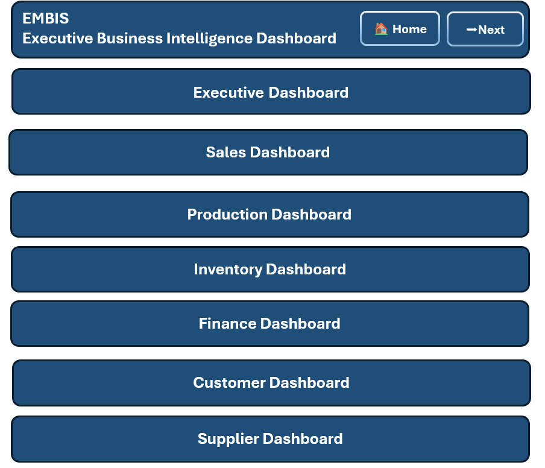
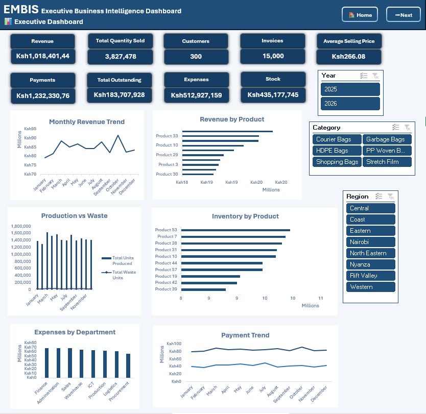
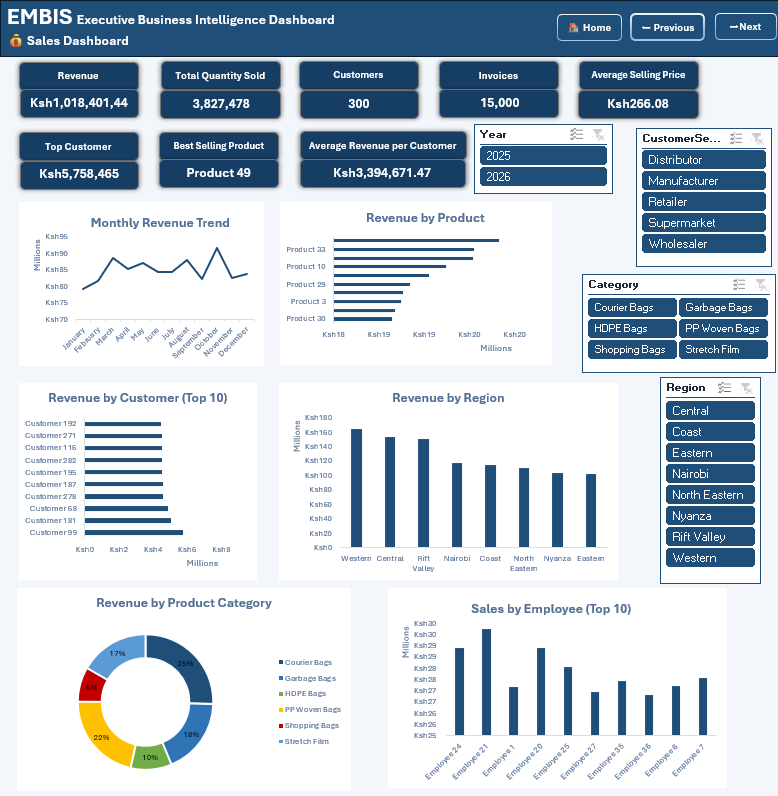
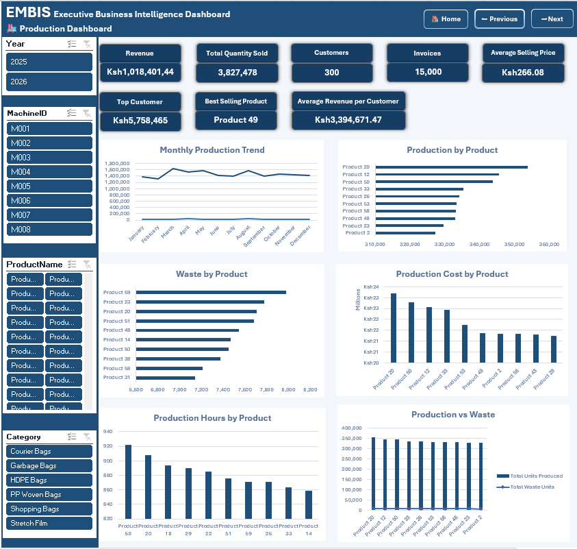
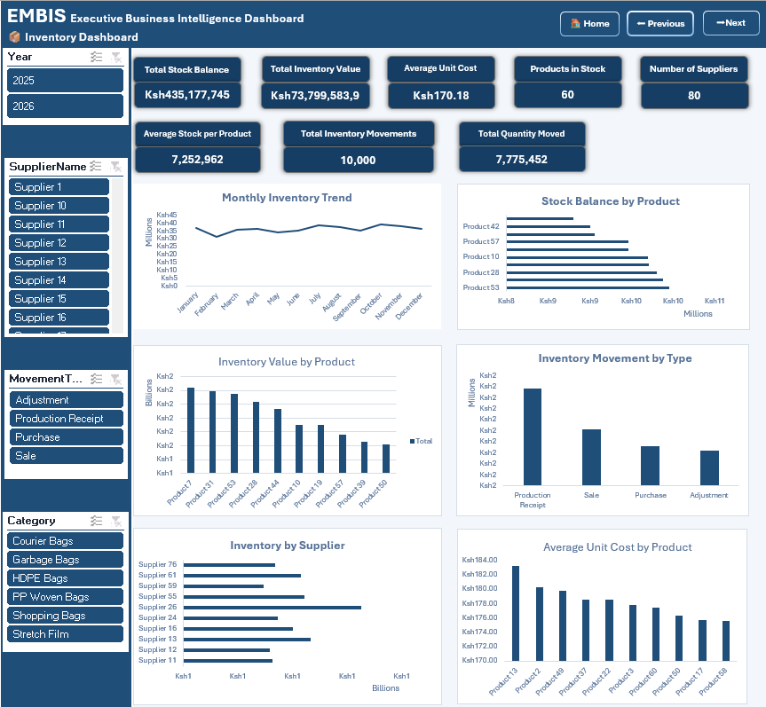
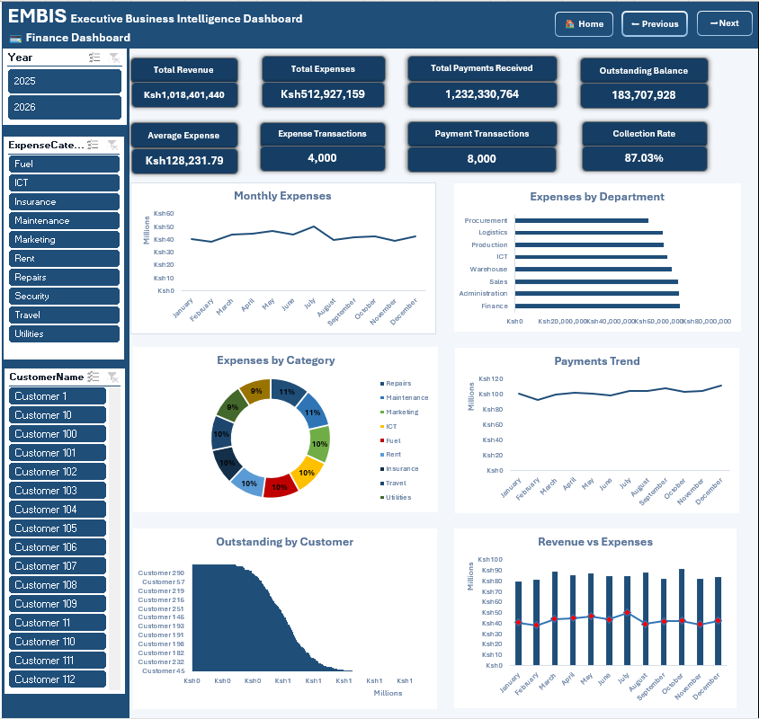
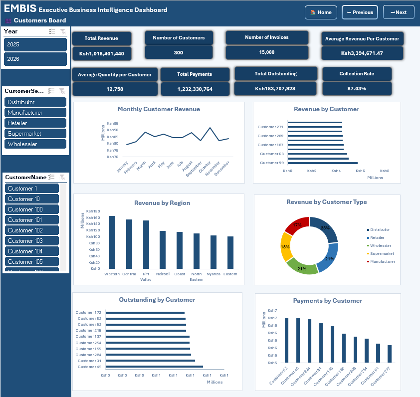
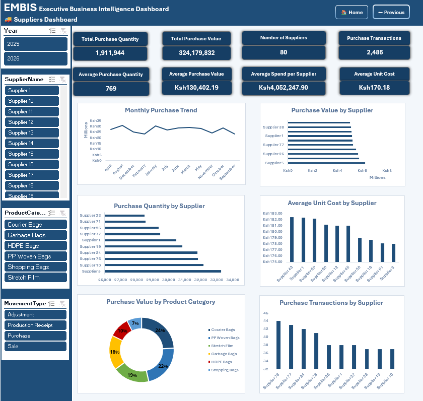

# Enterprise Manufacturing Business Intelligence System (EMBIS)

<p align="center">

</p>

<p align="center">


</p>

---

# Enterprise Manufacturing Business Intelligence System (EMBIS)

A complete **Business Intelligence reporting solution** developed in **Microsoft Excel** using **Power Query**, **Power Pivot**, **DAX**, **PivotTables**, **PivotCharts**, and **Interactive Dashboards**.

The solution transforms raw manufacturing data into executive-level insights across Sales, Production, Inventory, Finance, Customer, and Supplier operations.

---

# Project Objectives

The project was designed to:

- Automate data extraction and transformation using Power Query
- Design a Star Schema data model
- Build reusable DAX measures
- Develop interactive executive dashboards
- Enable business users to make data-driven decisions
- Demonstrate an end-to-end Business Intelligence workflow

---

# Business Problem

Manufacturing organizations often manage operational data across multiple departments, making it difficult to gain a consolidated view of business performance.

EMBIS solves this challenge by integrating operational data into a centralized reporting solution that provides real-time insights into:

- Sales Performance
- Production Operations
- Inventory Management
- Financial Performance
- Customer Analytics
- Supplier Performance

---

# Technology Stack

| Technology | Purpose |
|------------|---------|
| Microsoft Excel | Dashboard Development |
| Power Query | ETL & Data Cleaning |
| Power Pivot | Data Modelling |
| DAX | KPI Calculations |
| PivotTables | Data Aggregation |
| PivotCharts | Data Visualization |
| Slicers | Interactive Filtering |

---

# Solution Architecture

```
Raw Data
      │
      ▼
Power Query
      │
      ▼
Data Cleaning
      │
      ▼
Star Schema Data Model
      │
      ▼
Power Pivot Relationships
      │
      ▼
DAX Measures
      │
      ▼
Pivot Tables
      │
      ▼
Interactive Dashboards
```

---

# Data Model

## Fact Tables

- FactSales
- FactProduction
- FactInventory
- FactPayments
- FactExpenses

## Dimension Tables

- DimDate
- DimCustomer
- DimProduct
- DimSupplier
- DimEmployee
- DimRegion

---

# Dashboard Gallery

## Dashboard Index


---

## Executive Dashboard



Provides an executive overview of organizational performance.

### KPIs

- Total Revenue
- Gross Profit
- Profit Margin
- Inventory Value
- Customer Count
- Supplier Count

---

## Sales Dashboard



### Key Insights

- Monthly Revenue
- Revenue by Product
- Revenue by Customer
- Sales Trends

---

## Production Dashboard



### Key Insights

- Production Volume
- Waste Analysis
- Production Cost
- Production Hours

---

## Inventory Dashboard



### Key Insights

- Inventory Value
- Stock Balance
- Inventory Movement
- Supplier Inventory

---

## Finance Dashboard



### Key Insights

- Revenue
- Expenses
- Payments
- Outstanding Balances

---

## Customer Dashboard



### Key Insights

- Customer Revenue
- Customer Segmentation
- Payment Analysis
- Outstanding Balances

---

## Supplier Dashboard



### Key Insights

- Purchase Value
- Purchase Quantity
- Supplier Spend
- Procurement Trends

---

# Key Features

- Automated ETL using Power Query
- Star Schema Data Model
- DAX KPI Engine
- Seven Interactive Dashboards
- Executive KPI Cards
- Dynamic Pivot Charts
- Cross-filtering Slicers
- Dashboard Navigation Menu
- Standardized Dashboard Layout
- Interactive Business Reporting

---

# Skills Demonstrated

- Business Intelligence
- Data Analytics
- Data Cleaning
- ETL Development
- Data Modelling
- Star Schema Design
- DAX Development
- Dashboard Design
- KPI Development
- Excel Automation
- Data Visualization
- Executive Reporting

---

# Repository Structure

```
enterprise-manufacturing-bi-system-excel
│
├── README.md
├── LICENSE
│
├── Excel Dashboard
│     ├── EMBIS_Dashboard.xlsx
│     └── EMBIS_Data_Source.xlsx
│
├── Documentation
│     ├── EMBIS_Case_Study.pdf
│     ├── Project_Overview.pdf
│     ├── Data_Dictionary.xlsx
│     ├── ERD.png
│     ├── Data_Model.png
│     ├── KPI_Catalogue.xlsx
│     ├── Technical_Architecture.pdf
│     └── Dashboard_User_Guide.pdf
│
├── Images
│     ├── Dashboard_Index.png
│     ├── Executive_Dashboard.png
│     ├── Sales_Dashboard.png
│     ├── Production_Dashboard.png
│     ├── Inventory_Dashboard.png
│     ├── Finance_Dashboard.png
│     ├── Customer_Dashboard.png
│     └── Supplier_Dashboard.png
│
└── Power BI Version
      └── Coming_Soon.md
```

---

# Future Enhancements

- Power BI Version
- SQL Database Integration
- Automated Data Refresh
- Python Data Pipeline
- Forecasting Models
- Executive Scorecards
- Predictive Analytics

---

# About the Author

## Jack Kisutsa

Business Intelligence Analyst | Business Analyst | Data Analytics

**Skills**

- Microsoft Excel
- Power Query
- Power Pivot
- DAX
- SQL
- Power BI
- Data Visualization
- Dashboard Development

**GitHub**

https://github.com/kisutsajack-ai

---

# License

This project is licensed under the MIT License.

---

### ⭐ If you found this project interesting, consider giving it a star on GitHub.
