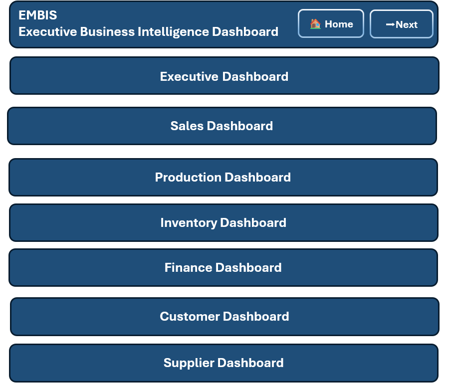
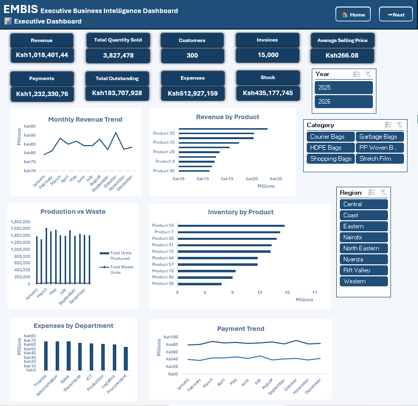
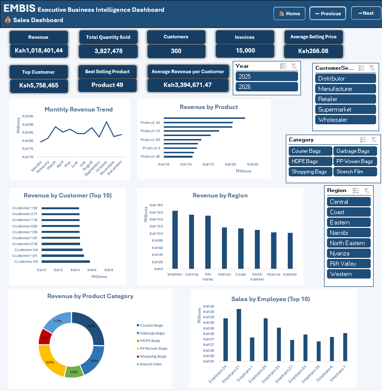
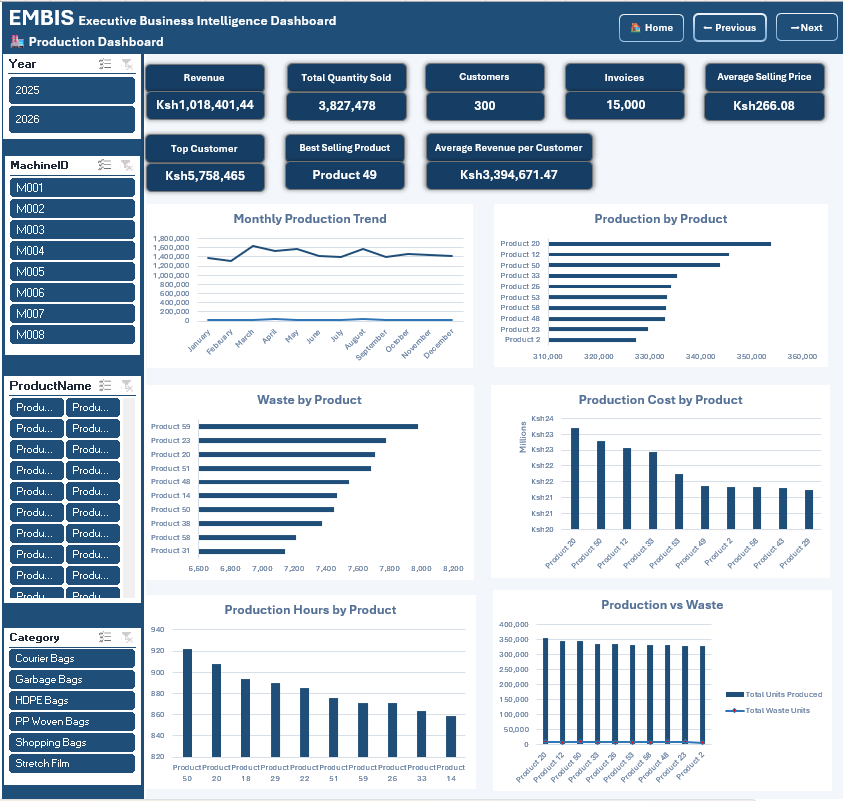
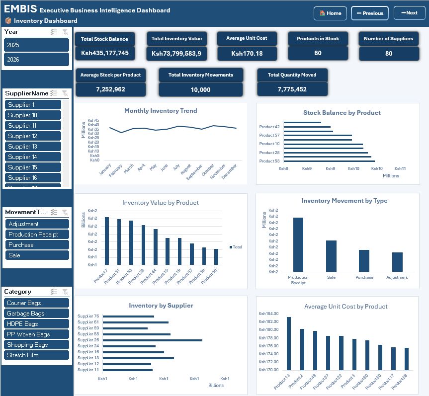
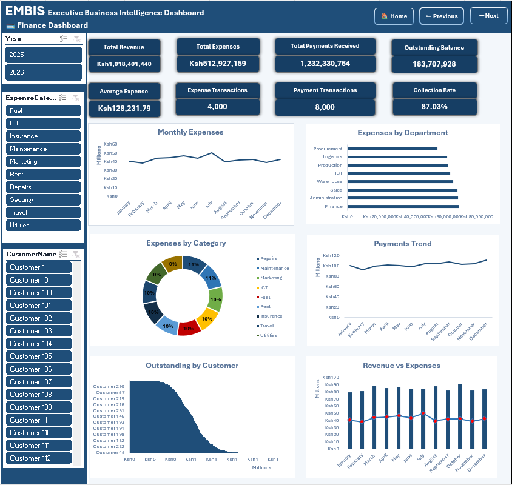
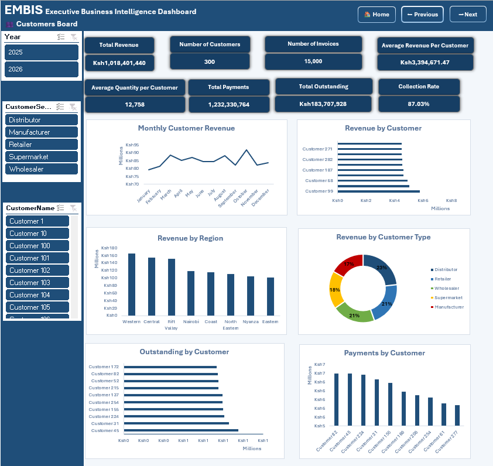
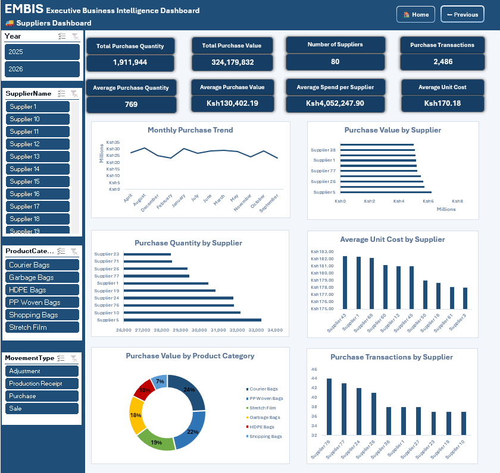

# Enterprise Manufacturing Business Intelligence System (EMBIS)

<p align="center">

</p>

<p align="center">


</p>

---

# Enterprise Manufacturing Business Intelligence System (EMBIS)

A complete **Business Intelligence reporting solution** developed in **Microsoft Excel** using **Power Query**, **Power Pivot**, **DAX**, **PivotTables**, **PivotCharts**, and **Interactive Dashboards**.

The solution transforms raw manufacturing data into executive-level insights across Sales, Production, Inventory, Finance, Customer, and Supplier operations.

---

# Project Objectives

The project was designed to:

- Automate data extraction and transformation using Power Query
- Design a Star Schema data model
- Build reusable DAX measures
- Develop interactive executive dashboards
- Enable business users to make data-driven decisions
- Demonstrate an end-to-end Business Intelligence workflow

---

# Business Problem

Manufacturing data is often managed separately by different departments. This creates fragmented reporting, inconsistent KPIs, duplicated manual work, and limited visibility into how operational decisions affect financial results.

EMBIS solves this challenge by integrating operational data into a centralized reporting solution that provides real-time insights into:

- Sales Performance
- Production Operations
- Inventory Management
- Financial Performance
- Customer Analytics
- Supplier Performance
  
Management needed one reporting environment capable of answering questions such as:

- Are revenue and profitability improving?
- Which products and customers generate the most value?
- How efficiently is production converting inputs into output?
- Where are waste, stock, expense, or payment risks emerging?
- Which suppliers and customers require management attention?

# Approach

1. Structured the raw operational data into five fact tables and six shared dimensions.
2. Used Power Query to clean, standardize, and prepare repeatable data transformations.
3. Built a star-schema model in Power Pivot.
4. Created reusable DAX measures for revenue, profit, margin, production, inventory, expenses, payments, and outstanding balances.
5. Developed PivotTable analytical layers and seven role-based dashboards.
6. Added navigation, slicers, KPI cards, and consistent page layouts.
7. Produced a governance pack covering requirements, data definitions, KPIs, architecture, traceability, and user guidance.
   
---

# Technology Stack

| Technology | Purpose |
|------------|---------|
| Microsoft Excel | Dashboard Development |
| Power Query | ETL & Data Cleaning |
| Power Pivot | Data Modelling |
| DAX | KPI Calculations |
| PivotTables | Data Aggregation |
| PivotCharts | Data Visualization |
| Slicers | Interactive Filtering |

---

# Solution Architecture

```
Raw Data
      │
      ▼
Power Query
      │
      ▼
Data Cleaning
      │
      ▼
Star Schema Data Model
      │
      ▼
Power Pivot Relationships
      │
      ▼
DAX Measures
      │
      ▼
Pivot Tables
      │
      ▼
Interactive Dashboards
```

---

# Data Model

## Fact Tables

- FactSales
- FactProduction
- FactInventory
- FactPayments
- FactExpenses

## Dimension Tables

- DimDate
- DimCustomer
- DimProduct
- DimSupplier
- DimEmployee
- DimRegion

---

# Dashboard Gallery

## Dashboard Index


---

## Executive Dashboard



Provides an executive overview of organizational performance.

### KPIs

- Total Revenue
- Gross Profit
- Profit Margin
- Inventory Value
- Customer Count
- Supplier Count

---

## Sales Dashboard



### Key Insights

- Monthly Revenue
- Revenue by Product
- Revenue by Customer
- Sales Trends

---

## Production Dashboard



### Key Insights

- Production Volume
- Waste Analysis
- Production Cost
- Production Hours

---

## Inventory Dashboard



### Key Insights

- Inventory Value
- Stock Balance
- Inventory Movement
- Supplier Inventory

---

## Finance Dashboard



### Key Insights

- Revenue
- Expenses
- Payments
- Outstanding Balances

---

## Customer Dashboard



### Key Insights

- Customer Revenue
- Customer Segmentation
- Payment Analysis
- Outstanding Balances

---

## Supplier Dashboard



### Key Insights

- Purchase Value
- Purchase Quantity
- Supplier Spend
- Procurement Trends

---

# Insights

The system enables decision-makers to:

- Trace headline financial performance back to products, customers, regions, and operational activity.
- Compare production output with waste, cost, and machine activity.
- Identify inventory movement and stock-balance patterns requiring intervention.
- Monitor departmental expenditure alongside payments and outstanding balances.
- Prioritize high-value customers and suppliers using consistent performance measures.

The repository uses a demonstration dataset; therefore, insights illustrate the analytical capability of the system rather than the performance of a real company.

# Recommendations

- Establish monthly KPI review meetings using the Executive Dashboard as the control page.
- Investigate products with strong revenue but weak margin, high waste, or high production cost.
- Set inventory thresholds and exception alerts for slow-moving or vulnerable stock.
- Segment customer follow-up according to revenue contribution and outstanding balances.
- Use supplier spend and delivery patterns to support sourcing and negotiation decisions.
- Assign KPI owners and refresh responsibilities to preserve reporting governance.

# Business Value

- Replaces fragmented departmental reporting with one analytical model.
- Reduces repeated data preparation through reusable Power Query steps.
- Standardizes definitions through a governed DAX and KPI layer.
- Provides executives with both enterprise-level and operational drill-down views.
- Demonstrates a practical BI solution that can later migrate to Power BI or a SQL-backed platform.
  
---

# Key Features

- Automated ETL using Power Query
- Star Schema Data Model
- DAX KPI Engine
- Seven Interactive Dashboards
- Executive KPI Cards
- Dynamic Pivot Charts
- Cross-filtering Slicers
- Dashboard Navigation Menu
- Standardized Dashboard Layout
- Interactive Business Reporting

---

# Skills Demonstrated

- Business Intelligence
- Data Analytics
- Data Cleaning
- ETL Development
- Data Modelling
- Star Schema Design
- DAX Development
- Dashboard Design
- KPI Development
- Excel Automation
- Data Visualization
- Executive Reporting


# Limitations

- The current solution uses a demonstration dataset rather than live ERP data.
- Refresh remains workbook-based and depends on consistent source-file structures.
- Forecasting, automated alerts, row-level security, and cloud distribution are outside the current scope.

# Future Improvements

- Develop a Power BI version.
- Connect the model to a SQL database or ERP extract.
- Automate scheduled refresh and exception alerts.
- Add forecasting, executive scorecards, and predictive analysis.
- Introduce formal data-quality monitoring.
  
---

# Repository Structure

```
enterprise-manufacturing-bi-system-excel
│
├── README.md
├── LICENSE
│
├── Excel Dashboard
│     ├── EMBIS_Dashboard.xlsx
│     └── EMBIS_Data_Source.xlsx
│
├── Documentation
│     ├── EMBIS_Case_Study.pdf
│     ├── Project_Overview.pdf
│     ├── Data_Dictionary.xlsx
│     ├── ERD.png
│     ├── Data_Model.png
│     ├── KPI_Catalogue.xlsx
│     ├── Technical_Architecture.pdf
│     └── Dashboard_User_Guide.pdf
│
├── Images
│     ├── Dashboard_Index.png
│     ├── Executive_Dashboard.png
│     ├── Sales_Dashboard.png
│     ├── Production_Dashboard.png
│     ├── Inventory_Dashboard.png
│     ├── Finance_Dashboard.png
│     ├── Customer_Dashboard.png
│     └── Supplier_Dashboard.png
│
└── Power BI Version
      └── Coming_Soon.md

```

---

# About the Author

## Jack Kisutsa

Business Intelligence Analyst | Business Analyst | Data Analytics

**Skills**

- Microsoft Excel
- Power Query
- Power Pivot
- DAX
- SQL
- Power BI
- Data Visualization
- Dashboard Development

**GitHub**

https://github.com/kisutsajack-ai

---

# License

This project is licensed under the MIT License.

---

### ⭐ If you found this project interesting, consider giving it a star on GitHub.
